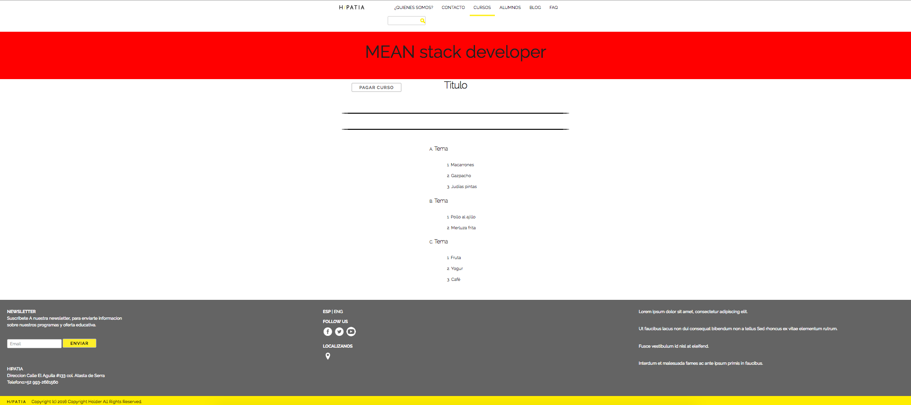

# HDH Platform

### First Iteration

## User Histories

- [ ] As a manager I want to be able to view a list of all my Courses
- [ ] As a manager I want to be able to add new Courses, so i can have them in a database
- [ ] As a manager I want to add a photo for my courses
- [ ] As a manager I want to be able to edit existing Courses.
- [ ] As a manager I want to be able to logic delete Courses.

## Wireframes
Index

New Course

Edit Course

Delete Course

## DB Schema

First Schema

### Second Iteration

## User Histories

- [ ] as a user anonymous I want see the available courses in the web page.
- [ ] as a user anonymous I want login or sign in to start a course.
- [ ] as a registered user I want see the course program.
- [ ] as a registered user I want to pay the course of my interest to be able enter to content.
- [ ] as a registered user I want see the content of course, previously paid.

## Wireframes

Index

Courses

Login

Sign In

Email

New password

Path

Pay

Course Page

## Web Pages
Index

Courses

- Web page that show the information of all available courses that is impart in the platform.
- Each frame consists of an image, title of course and a brief description.

Login

- Web page that consists inserting the user data for a login.

Sign In

- Web page for a user unregistered, inserting only the email.

Email

New password

Path

Pay

Course Page

